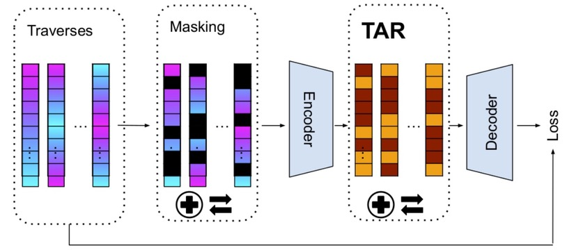

# Spectral Spatial Traversing in Point Clouds

## Latest Update

Specify the beter-up parts and the usage.

## Overview

<div  align="center">    
 
</div>


## Dataset

Download: You can download the processed data from [Point-BERT repo](https://github.com/lulutang0608/Point-BERT/blob/49e2c7407d351ce8fe65764bbddd5d9c0e0a4c52/DATASET.md), or download from the [official website](https://modelnet.cs.princeton.edu/#) and process it by yourself. The txt file are available here: [[modelnet40_shape_names.txt](https://github.com/LMD0311/PointMamba/files/15107315/modelnet40_shape_names.txt)] [ [modelnet40_test.txt](https://github.com/LMD0311/PointMamba/files/15107318/modelnet40_test.txt)] [[modelnet40_train.txt](https://github.com/LMD0311/PointMamba/files/15107320/modelnet40_train.txt)].

### ScanObjectNN Dataset:

Download: Please download the data from the [official website](https://hkust-vgd.github.io/scanobjectnn/).

### ShapeNet55/34 Dataset:

Download: Please download the data from [Point-BERT repo](https://github.com/lulutang0608/Point-BERT/blob/49e2c7407d351ce8fe65764bbddd5d9c0e0a4c52/DATASET.md).

### ShapeNetPart Dataset:

Download: Please download the data from [here](https://shapenet.cs.stanford.edu/media/shapenetcore_partanno_segmentation_benchmark_v0_normal.zip). 


# Preparation

## Environment

This codebase was tested with the following environment configurations. It may work with other versions.
- Ubuntu 20.04
- CUDA 11.7
- Python 3.9
- PyTorch 1.13.1 + cu117

# Training

## Pre-train

```shell
CUDA_VISIBLE_DEVICES=<GPU> python main.py --config cfgs/pretrain.yaml --exp_name <name>
```
## Classification on ModelNet40

```shell
# Training from scratch.
CUDA_VISIBLE_DEVICES=<GPU> python main.py --scratch_model --config cfgs/finetune_modelnet.yaml --exp_name <name>

# Training from pre-training.
CUDA_VISIBLE_DEVICES=<GPU> python main.py --finetune_model --config cfgs/finetune_modelnet.yaml --ckpts <path/to/pre-trained/model> --exp_name <name>
```
## Classification on ScanObjectNN

```shell
# Training from scratch.
CUDA_VISIBLE_DEVICES=<GPU> python main.py --scratch_model --config cfgs/finetune_scan_objbg.yaml --exp_name <name>

# Training from pre-training.
CUDA_VISIBLE_DEVICES=<GPU> python main.py --finetune_model --config cfgs/finetune_scan_objbg.yaml --ckpts <path/to/pre-trained/model> --exp_name <name>
```

## Few-Shot on ModelNet40
```shell
# Training from pre-training.
CUDA_VISIBLE_DEVICES=<GPU> python main.py --finetune_model --config cfgs/fewshot.yaml --ckpts <path/to/pre-trained/model> --exp_name <name>
```
## Part Segmentation on ShapeNetPart

```shell
cd part_segmentation
# Training from scratch.
CUDA_VISIBLE_DEVICES=<GPU> python main.py --config cfgs/config.yaml --log_dir <name>

# Training from pre-training.
CUDA_VISIBLE_DEVICES=<GPU> python main.py --config cfgs/config.yaml --ckpts <path/to/pre-trained/model> --log_dir <name>
```

## Acknowledgement

This project is based on Point-Mamba ([paper](https://arxiv.org/pdf/2402.10739), [code](https://github.com/LMD0311/PointMamba)), Point-BERT ([paper](https://arxiv.org/abs/2111.14819), [code](https://github.com/lulutang0608/Point-BERT?tab=readme-ov-file)), Point-MAE ([paper](https://arxiv.org/abs/2203.06604), [code](https://github.com/Pang-Yatian/Point-MAE)), Mamba ([paper](https://arxiv.org/abs/2312.00752), [code](https://github.com/state-spaces/mamba)), Causal-Conv1d ([code](https://github.com/Dao-AILab/causal-conv1d)). Thanks for their wonderful works.


