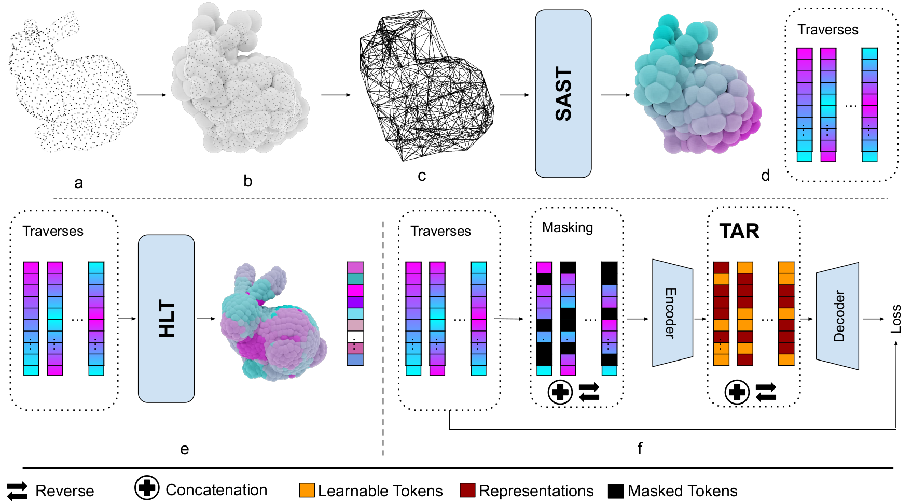

# Spectral Spatial Traversing in Point Clouds


## Abstract

\gls*{ssm} such as Mamba have shown significant promise for sequence modeling in \gls*{nlp} and, more recently, computer vision. This paper presents a new methodology for both supervised and self-supervised learning using Mamba and Masked Autoencoder networks specifically designed for point cloud data. We propose three main contributions that enhance the capability of Mamba networks to process and understand the complex structure of this type of data. The first strategy exploits the spectrum of a graph Laplacian capturing the local connectivity of patches to define an isometry-invariant traversal order of tokens in the Mamba network. Compared to existing point cloud Mamba architectures, which traverse point patches based on a 3D grid, our approach is more robust to the viewpoint and better captures the shape manifold of the point cloud. The second contribution adapts our approach to segmentation using a recursive patch partitioning strategy informed by spectral components of the Laplacian. This strategy enables a more precise integration and analysis point cloud segments. Our last contribution tackles a significant issue in \gls*{mae} for Mamba networks by modifying learnable token placement. Instead of adding them at the end, tokens are restored to their original positions, maintaining essential order and improving learning effectiveness. Extensive experiments confirm our method's superiority over \gls*{sota} baselines, demonstrating marked improvements in classification, segmentation, and few-shot tasks.


## Overview

<div  align="center">    
 
</div>


## Dataset

The overall directory structure should be:
```
│PointMamba/
├──cfgs/
├──data/
│   ├──ModelNet/
│   ├──ScanObjectNN/
│   ├──ShapeNet55-34/
│   ├──shapenetcore_partanno_segmentation_benchmark_v0_normal/
├──datasets/
├──.......
```

### ModelNet40 Dataset: 

```
│ModelNet/
├──modelnet40_normal_resampled/
│  ├── modelnet40_shape_names.txt
│  ├── modelnet40_train.txt
│  ├── modelnet40_test.txt
│  ├── modelnet40_train_8192pts_fps.dat
│  ├── modelnet40_test_8192pts_fps.dat
```

Download: You can download the processed data from [Point-BERT repo](https://github.com/lulutang0608/Point-BERT/blob/49e2c7407d351ce8fe65764bbddd5d9c0e0a4c52/DATASET.md), or download from the [official website](https://modelnet.cs.princeton.edu/#) and process it by yourself. The txt file are available here: [[modelnet40_shape_names.txt](https://github.com/LMD0311/PointMamba/files/15107315/modelnet40_shape_names.txt)] [ [modelnet40_test.txt](https://github.com/LMD0311/PointMamba/files/15107318/modelnet40_test.txt)] [[modelnet40_train.txt](https://github.com/LMD0311/PointMamba/files/15107320/modelnet40_train.txt)].

### ScanObjectNN Dataset:

```
│ScanObjectNN/
├──main_split/
│  ├── training_objectdataset_augmentedrot_scale75.h5
│  ├── test_objectdataset_augmentedrot_scale75.h5
│  ├── training_objectdataset.h5
│  ├── test_objectdataset.h5
├──main_split_nobg/
│  ├── training_objectdataset.h5
│  ├── test_objectdataset.h5
```
Download: Please download the data from the [official website](https://hkust-vgd.github.io/scanobjectnn/).

### ShapeNet55/34 Dataset:

```
│ShapeNet55-34/
├──shapenet_pc/
│  ├── 02691156-1a04e3eab45ca15dd86060f189eb133.npy
│  ├── 02691156-1a6ad7a24bb89733f412783097373bdc.npy
│  ├── .......
├──ShapeNet-55/
│  ├── train.txt
│  └── test.txt
```

Download: Please download the data from [Point-BERT repo](https://github.com/lulutang0608/Point-BERT/blob/49e2c7407d351ce8fe65764bbddd5d9c0e0a4c52/DATASET.md).

### ShapeNetPart Dataset:

```
|shapenetcore_partanno_segmentation_benchmark_v0_normal/
├──02691156/
│  ├── 1a04e3eab45ca15dd86060f189eb133.txt
│  ├── .......
│── .......
│──train_test_split/
│──synsetoffset2category.txt
```

Download: Please download the data from [here](https://shapenet.cs.stanford.edu/media/shapenetcore_partanno_segmentation_benchmark_v0_normal.zip). 


# Preparation

## Environment

This codebase was tested with the following environment configurations. It may work with other versions.
- Ubuntu 20.04
- CUDA 11.7
- Python 3.9
- PyTorch 1.13.1 + cu117

## Installation

We recommend using Anaconda for the installation process:

```shell
# Create virtual env and install PyTorch
$ conda create -n SSTmamba python=3.9
$ conda activate SSTmamba
(SSTmamba) $ pip install torch==1.13.1+cu117 torchvision==0.14.1+cu117 torchaudio==0.13.1 --extra-index-url https://download.pytorch.org/whl/cu117

# Install basic required packages
(SSTmamba) $ pip install -r requirements.txt

# Chamfer Distance & emd
(SSTmamba) $ cd ./extensions/chamfer_dist && python setup.py install --user
(SSTmamba) $ cd ./extensions/emd && python setup.py install --user

# PointNet++
(SSTmamba) $ pip install "git+https://github.com/erikwijmans/Pointnet2_PyTorch.git#egg=pointnet2_ops&subdirectory=pointnet2_ops_lib"

# GPU kNN
(SSTmamba) $ pip install --upgrade https://github.com/unlimblue/KNN_CUDA/releases/download/0.2/KNN_CUDA-0.2-py3-none-any.whl

# Mamba
(SSTmamba) $ pip install causal-conv1d==1.1.1
(SSTmamba) $ pip install mamba-ssm==1.1.1
```

# Training

## Pre-train

```shell
CUDA_VISIBLE_DEVICES=<GPU> python main.py --config cfgs/pretrain.yaml --exp_name <name>
```
## Classification on ModelNet40

```shell
# Training from scratch.
CUDA_VISIBLE_DEVICES=<GPU> python main.py --scratch_model --config cfgs/finetune_modelnet.yaml --exp_name <name>

# Training from pre-training.
CUDA_VISIBLE_DEVICES=<GPU> python main.py --finetune_model --config cfgs/finetune_modelnet.yaml --ckpts <path/to/pre-trained/model> --exp_name <name>
```
## Classification on ScanObjectNN

```shell
# Training from scratch.
CUDA_VISIBLE_DEVICES=<GPU> python main.py --scratch_model --config cfgs/finetune_scan_objbg.yaml --exp_name <name>

# Training from pre-training.
CUDA_VISIBLE_DEVICES=<GPU> python main.py --finetune_model --config cfgs/finetune_scan_objbg.yaml --ckpts <path/to/pre-trained/model> --exp_name <name>
```

## Few-Shot on ModelNet40
```shell
# Training from pre-training.
CUDA_VISIBLE_DEVICES=<GPU> python main.py --finetune_model --config cfgs/fewshot.yaml --ckpts <path/to/pre-trained/model> --exp_name <name>
```
## Part Segmentation on ShapeNetPart

```shell
cd part_segmentation
# Training from scratch.
CUDA_VISIBLE_DEVICES=<GPU> python main.py --config cfgs/config.yaml --log_dir <name>

# Training from pre-training.
CUDA_VISIBLE_DEVICES=<GPU> python main.py --config cfgs/config.yaml --ckpts <path/to/pre-trained/model> --log_dir <name>
```

## Acknowledgement

This project is based on Point-Mamba ([paper](https://arxiv.org/pdf/2402.10739), [code](https://github.com/LMD0311/PointMamba)), Point-BERT ([paper](https://arxiv.org/abs/2111.14819), [code](https://github.com/lulutang0608/Point-BERT?tab=readme-ov-file)), Point-MAE ([paper](https://arxiv.org/abs/2203.06604), [code](https://github.com/Pang-Yatian/Point-MAE)), Mamba ([paper](https://arxiv.org/abs/2312.00752), [code](https://github.com/state-spaces/mamba)), Causal-Conv1d ([code](https://github.com/Dao-AILab/causal-conv1d)). Thanks for their wonderful works.


